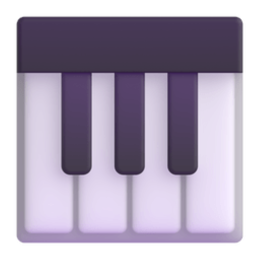
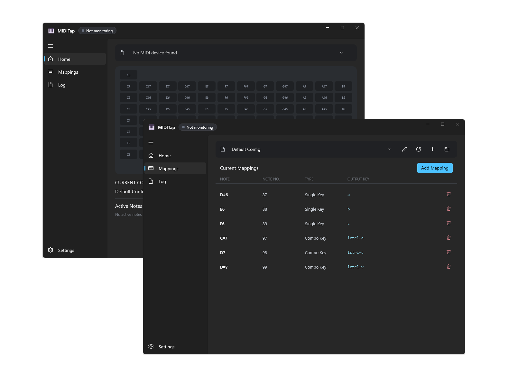

<div align="center">
  <h1 align="center">
    
    <br/>
    MIDITap
  </h1> 
  
  <p>
    A lightweight tool built with <a href="https://learn.microsoft.com/windows/apps/winui/">WinUI 3</a> and <a href="https://dotnet.microsoft.com/languages/csharp">C#</a>, mapping MIDI input to keyboard keys in real time
  </p>

<!-- Badges -->

[](https://dotnet.microsoft.com/languages/csharp)
[](LICENSE)
<br>


[](https://github.com/MarchSnow-1/MIDITap/releases)

[English](README.md) | [简体中文](README_zh-CN.md)

</div>

---

<div align="center">
  
</div>

## 📖 Introduction

MIDITap is a low-latency MIDI → keyboard mapping tool that calls native Windows APIs, built with C# + WinUI 3

If you encounter any issues, please feel free to submit feedback via [Issues](../../issues)

## ✨ Features

- 🎹 **Native Mapping**: calls Windows APIs (`SendInput`) to convert MIDI input into keyboard events in real time
- 🎵 **Sustain Support**: the key stays triggered while the MIDI note is held, and releases on let-go, for a natural feel
- 🔑 **Full Key Support**: letters, numbers, function keys, arrow keys, NumPad, media keys, and more
- 🖥️ **Friendly UI**: a polished native WinUI 3 interface with visual one-click binding, easy to pick up

## 🛠️ Requirements

- Windows 10 1809+ or any version of Windows 11 (x64)
- A MIDI device

## 🚀 Quick Start

1. Download the latest version from the [Releases](../../releases) page

2. Double-click the installer and install

3. Open MIDITap and start using it

- [Preset configurations](/preset-configs) are provided here for reference or direct use

## 📚 UI Guide

### GUI Interface

The app uses sidebar navigation with four pages: **Home**, **Mappings**, **Log**, and **Settings**

#### Home — Device Selection & Monitoring

1. Just pick a device in the **MIDI Devices** dropdown
   The device list refreshes live, and monitoring starts automatically as soon as a device is available
   Switching or unplugging the device stops monitoring and releases every held key
2. Pressing MIDI keys triggers the mapped keyboard output; the Home page highlights the active notes in real time
3. Clicking any note opens its mapping editor directly

#### Mappings — Mapping Management

- **Config**: switch configuration files, loading the one you pick
- **Refresh**: reload the configuration file list
- **Open Folder**: open the folder containing configuration files
- **Rename**: rename the configuration file
- **Add Mapping**:
  - **MIDI Note**: click **Capture Note** and trigger your MIDI device to auto-fill the note number (you can also type it in with the keyboard)
  - **Output Key**: choose a capture mode
    - **Single Key**: focus the input and press a single key (`a` / `enter` / `f1` etc.) to auto-fill
    - **Combo Key**: focus the input and press each key in sequence (e.g. `ctrl`, `shift`, `escape`) to build a combo
  - Click **Add** when you are done
- **Current Mappings**: shows every mapping in the current config; click the trash icon to delete one

#### Log Page

Full-window view of the Activity Log

#### Settings — Preferences

- **Language**: switch the UI language in real time
- **Appearance**: choose the theme colour used by the app
- **Config folder**: open the folder that holds your mapping configs
- **Activity log**: writes every activity-log entry to a local file
  When reporting a problem, you can export this run's log entries from the Log page and upload the resulting archive
  This feature is therefore **off by default**
- **Updates**: toggle "check for updates on startup"; when a new version is found you are notified
  Clicking update manually makes the app update itself and restart
- **Proxy**: used **only** for update checks and downloads. Leave it empty to follow the Windows system proxy
  An HTTP or Socks5 proxy can be entered (such as `http://127.0.0.1:8080` or `socks5://127.0.0.1:1080`)
  The scheme prefix is required; an invalid address is reported in the UI, which then falls back to the system proxy

## ✏️ Writing Config Files Manually

Config files are JSON5 and live in the `config/` directory next to `MIDITap.exe` (comments and trailing commas are allowed)

To write a whole set of mappings by hand instead of through the GUI, see the format reference and the **complete key name list** in [preset-configs](/preset-configs/README.md#️-writing-a-config-file-manually)

## 📦 Build from Source

### Prerequisites

- [.NET SDK 8.0+](https://dotnet.microsoft.com/download)
- Windows 10 1809+ / Windows 11
- Git

### Steps

```bash
# 1. Clone the repository
git clone https://github.com/MarchSnow-1/MIDITap.git
cd MIDITap

# 2. Run the unit tests
dotnet test MIDITap.sln

# 3. Run the app in debug mode (builds automatically)
dotnet run --project src/MIDITap.App/MIDITap.App.csproj -c Debug
```

The running app locks `MIDITap.exe`, so close it before rebuilding

## ⚠️ Disclaimer

- **This work is provided "as is", and the project author/contributors make no representations or warranties, express or implied**
- This tool works by simulating keyboard input, similar to utilities like AutoHotkey
- MIDITap is designed for general MIDI → keystroke mapping and is not specifically developed for gaming
- While there are currently no known cases of game account bans resulting from using this tool, some strict anti-cheat systems may be sensitive to third-party input software
- Therefore, **please review the terms of use or user agreement of the relevant software before use; by downloading this software, you accept all risks**
