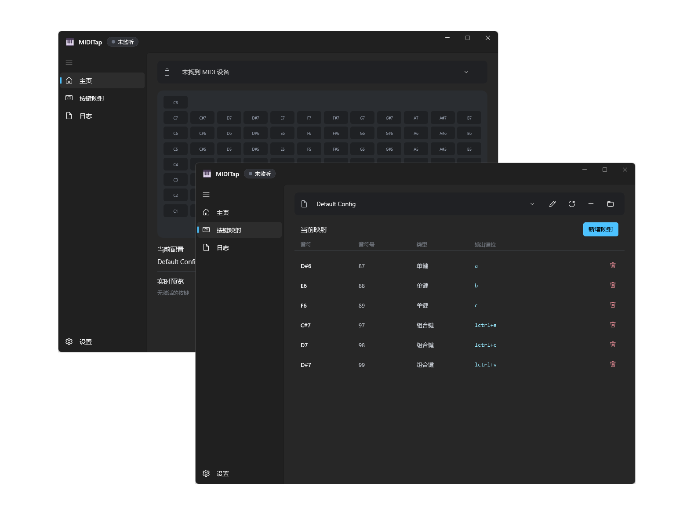

<div align="center">
  <h1 align="center">
    
    <br/>
    MIDITap
  </h1> 
  
  <p>
    一款基于 <a href="https://learn.microsoft.com/windows/apps/winui/">WinUI 3</a> 与 <a href="https://dotnet.microsoft.com/languages/csharp">C#</a> 开发，将 MIDI 输入实时映射为键盘按键的轻量工具
  </p>

<!-- Badges -->

[](https://dotnet.microsoft.com/languages/csharp)
[](LICENSE)
<br>


[](https://github.com/MarchSnow-1/MIDITap/releases)

[English](README.md) | [简体中文](README_zh-CN.md)

</div>

---

<div align="center">
  
</div>

## 📖 使用须知

MIDITap 是一个调用 Windows 原生 API 的低延迟 MIDI → 键盘映射工具，使用 C# + WinUI 3 开发

如遇到问题, 欢迎至 [Issues](../../issues) 进行反馈

## ✨ 功能一览

- 🎹 **原生映射**：调用 Windows API (`SendInput`) 实时将 MIDI 输入转换为键盘事件
- 🎵 **长按支持**：按住琴键时对应按键持续触发，松开即释放，手感自然
- 🔑 **完整按键支持**：字母、数字、功能键、方向键、小键盘、媒体键，一应俱全
- 🖥️ **人性化 UI**：原生 WinUI 3 美观界面，附带可视化一键绑定功能，便于上手

## 🛠️ 环境要求

- Windows 10 1809+ 或任意版本的 Windows 11 (x64)
- 一台 MIDI 设备

## 🚀 快速开始

1. 前往 [Release](../../releases) 页面下载最新版本

2. 双击安装程序并安装

3. 打开 MIDITap 程序，即可开始使用

- [此处](/preset-configs/README_zh-CN.md) 提供了一些预设供参考或使用，可下载查看

## 📚 UI 介绍

### GUI 界面

应用采用侧边栏导航，共四页：**主页**、**按键映射**、**日志**、**设置**

#### 主页 — 设备选择与监听

1. 在 **MIDI 设备** 下拉框中选择设备即可
   程序支持热刷新设备列表，只要设备可用就会自动开始监听
   切换/拔出设备则停止监听并抬起所有被按住的按键
2. 按下 MIDI 琴键即可触发映射的键盘输出，主页面会实时高亮当前激活的音符
3. 点击任意音符可直接打开其对应的映射编辑器

#### 按键映射 — 映射管理

- **配置**：切换配置文件，选中即加载
- **刷新**：重新加载配置文件列表
- **打开目录**：打开配置文件所在文件夹
- **重命名**：重命名配置文件
- **新增映射**：
  - **MIDI 音符**：点击 **捕获音符** 后触发你的 MIDI 设备即可自动填入音符编号 (也可使用键盘直接输入)
  - **输出键位**：选择捕获模式
    - **单键**：聚焦输入框后按下一个按键 (a / enter / f1 等) 自动填入
    - **组合键**：聚焦输入框后依次按下各个按键 (如 ctrl、shift、escape)，自动拼合为组合键
  - 填写完毕后点击 **添加** 完成添加
- **当前映射**：显示当前配置的全部映射，点击垃圾桶图标可删除对应映射项

#### 日志页

展示完整的活动日志

#### 设置 — 偏好

- **语言**：实时切换多种语言
- **外观**：选择应用使用的主题颜色
- **配置目录**：打开配置所在文件夹
- **活动日志**：自动把每条活动日志写入本地文件
  反馈问题时可在日志页导出本次运行的日志记录，并上传打包好的压缩包
  故此功能 **默认关闭**
- **更新**：可开关"启动时检查更新"，发现新版本后会进行提示
  手动点击更新后，应用会进行更新并重新启动
- **代理**：仅用于更新检查与下载，留空则跟随 Windows 系统代理
  可填 HTTP 或 Socks5 代理 (如 `http://127.0.0.1:8080`、`socks5://127.0.0.1:1080`)
  需带协议前缀；地址格式无效时界面会提示，并自动退回系统代理

## ✏️ 手动编写配置文件

配置文件以 JSON5 格式存放在 `MIDITap.exe` 旁的 `config/` 目录 (支持注释与尾随逗号)

若想脱离界面手写整套映射，格式说明与**完整键名清单**见 [preset-configs](/preset-configs/README_zh-CN.md#️-手动编写配置格式)

## 📦 从源码构建

### 环境要求

- [.NET SDK 10.0+](https://dotnet.microsoft.com/download)
- Windows 10 1809+ / Windows 11
- Git

### 步骤

```bash
# 1. 克隆仓库
git clone https://github.com/MarchSnow-1/MIDITap.git
cd MIDITap

# 2. 运行单元测试
dotnet test MIDITap.sln

# 3. 以 Debug 模式运行应用 (会自动构建)
dotnet run --project src/MIDITap.App/MIDITap.App.csproj -c Debug
```

运行中的应用会锁定 `MIDITap.exe`，重新构建前请先关闭它

## ⚠️ 免责声明

- **本作品按“原样”提供，且项目作者/贡献者不提供任何明示或暗示的声明或保证**
- 本工具通过模拟键盘输入工作，与 AutoHotkey 等工具类似
- MIDITap 面向通用的 MIDI → 按键映射场景，并非专门为游戏开发
- 虽然目前没有因使用本工具而导致游戏封号的已知案例，但部分严格的反作弊系统可能对第三方输入软件敏感
- 因此，**使用前请自行了解相关软件的用户协议/使用条款，下载即表示接受全部风险**